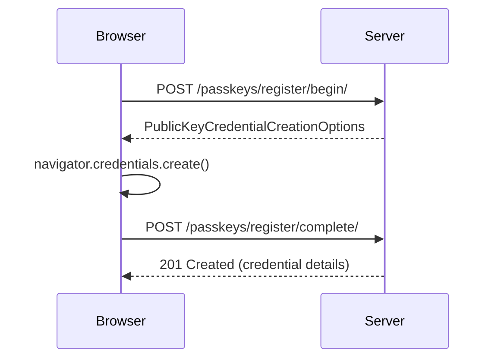
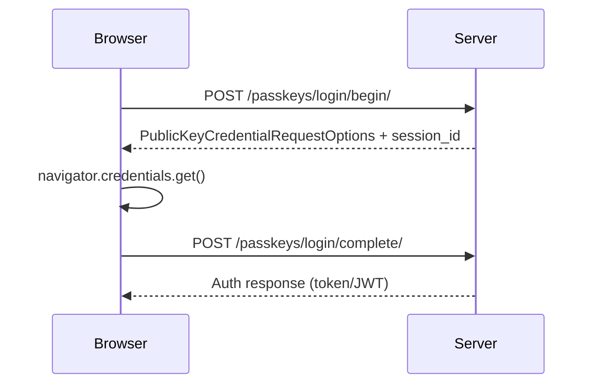

# Passkeys (WebAuthn)

dj-rest-auth includes optional passkey support for passwordless authentication using the FIDO2/WebAuthn standard. Users can register hardware security keys or platform authenticators (Touch ID, Windows Hello, Android biometrics) and use them to log in without a password.

## Overview

- **FIDO2/WebAuthn**: Industry-standard passwordless authentication
- **Platform authenticators**: Touch ID, Windows Hello, Android biometrics
- **Roaming authenticators**: Hardware security keys (YubiKey, etc.)
- **Discoverable credentials**: Supports resident keys for usernameless login
- **Credential management**: List, rename, and delete registered passkeys

## Setup

### 1) Install passkey extras

```bash
pip install 'dj-rest-auth[with-passkeys]'
```

`with-passkeys` installs the `webauthn` library.

### 2) Enable app

```python title="settings.py"
INSTALLED_APPS = [
    # ...
    'rest_framework',
    'rest_framework.authtoken',
    'dj_rest_auth',
    'dj_rest_auth.passkeys',
]
```

### 3) Configure relying party settings

```python title="settings.py"
REST_AUTH = {
    'PASSKEY_RP_ID': 'example.com',
    'PASSKEY_RP_NAME': 'My Application',
    'PASSKEY_RP_ORIGINS': ['https://example.com'],
}
```

!!! warning "Required Settings"
    `PASSKEY_RP_ID`, `PASSKEY_RP_NAME`, and `PASSKEY_RP_ORIGINS` must all be configured. A `ValidationError` is raised if any are missing.

!!! tip "Local Development"
    For local development, use:

    ```python
    REST_AUTH = {
        'PASSKEY_RP_ID': 'localhost',
        'PASSKEY_RP_NAME': 'My App (Dev)',
        'PASSKEY_RP_ORIGINS': ['http://localhost:8000'],
    }
    ```

### 4) Run migrations

```bash
python manage.py migrate
```

### 5) Include URLs

```python title="urls.py"
from django.urls import include, path

urlpatterns = [
    path('dj-rest-auth/', include('dj_rest_auth.urls')),
    path('dj-rest-auth/passkeys/', include('dj_rest_auth.passkeys.urls')),
]
```

## Registration flow

Passkey registration is a two-step challenge-response process. The user must be authenticated.

1. Client sends POST to `/passkeys/register/begin/` (optionally with a credential name).
2. API returns WebAuthn `PublicKeyCredentialCreationOptions` (challenge, relying party info, user info).
3. Client passes options to the browser's `navigator.credentials.create()` API.
4. Client sends the resulting credential to `/passkeys/register/complete/`.
5. API verifies the response and stores the credential.



## Login flow

Passkey login is also a two-step challenge-response process. No prior authentication is required.

1. Client sends POST to `/passkeys/login/begin/` (optionally with `username` or `email` to scope credentials).
2. API returns WebAuthn `PublicKeyCredentialRequestOptions` and a `session_id`.
3. Client passes options to the browser's `navigator.credentials.get()` API.
4. Client sends the resulting assertion and `session_id` to `/passkeys/login/complete/`.
5. API verifies the assertion and returns a full auth response (token, JWT, or session).



## Endpoints

### Register Begin

`POST /dj-rest-auth/passkeys/register/begin/`

Authentication required.

Request fields:

- `name` (optional) — friendly name for the credential

Response: WebAuthn `PublicKeyCredentialCreationOptions` JSON.

### Register Complete

`POST /dj-rest-auth/passkeys/register/complete/`

Authentication required.

Request fields:

- `credential` — the credential response from `navigator.credentials.create()`
- `name` (optional) — friendly name (defaults to "Passkey")

Response (201): registered credential details.

### Login Begin

`POST /dj-rest-auth/passkeys/login/begin/`

No authentication required.

Request fields:

- `username` (optional) — scope credentials to a specific user
- `email` (optional) — scope credentials to a specific user

Response: WebAuthn `PublicKeyCredentialRequestOptions` JSON + `session_id`.

### Login Complete

`POST /dj-rest-auth/passkeys/login/complete/`

No authentication required.

Request fields:

- `credential` — the assertion response from `navigator.credentials.get()`
- `session_id` — the UUID returned by login begin

Response: standard auth response (same as login — token key, JWT, or session).

### List Passkeys

`GET /dj-rest-auth/passkeys/`

Authentication required. Returns all passkeys for the authenticated user, ordered by creation date (newest first).

Response fields per credential:

- `id`, `name`, `credential_id` (base64url), `created_at`, `last_used_at`, `transports`, `discoverable`

### Passkey Detail

```
GET    /dj-rest-auth/passkeys/{id}/
PATCH  /dj-rest-auth/passkeys/{id}/
DELETE /dj-rest-auth/passkeys/{id}/
```

Authentication required. Users can only access their own credentials.

- **GET** — retrieve credential details
- **PATCH** — rename a credential (`{"name": "new name"}`)
- **DELETE** — remove a credential (204 No Content)

## Security behavior

- Challenges are cached server-side and expire after `PASSKEY_CHALLENGE_TIMEOUT` (default 300s)
- Challenges are single-use — deleted from cache after verification
- `sign_count` is checked on each authentication to detect cloned authenticators
- Session IDs are random UUIDs, unique per login attempt
- Inactive users cannot authenticate via passkey
- Credential IDs are unique across all users

## Settings

Configure via `REST_AUTH`:

```python title="settings.py"
REST_AUTH = {
    # Required
    'PASSKEY_RP_ID': 'example.com',
    'PASSKEY_RP_NAME': 'My Application',
    'PASSKEY_RP_ORIGINS': ['https://example.com'],

    # Optional
    'PASSKEY_CHALLENGE_TIMEOUT': 300,  # seconds (default: 300)
}
```

All serializers are overridable:

```python title="settings.py"
REST_AUTH = {
    'PASSKEY_REGISTER_BEGIN_SERIALIZER': 'myapp.serializers.CustomRegisterBeginSerializer',
    'PASSKEY_REGISTER_COMPLETE_SERIALIZER': 'myapp.serializers.CustomRegisterCompleteSerializer',
    'PASSKEY_LOGIN_BEGIN_SERIALIZER': 'myapp.serializers.CustomLoginBeginSerializer',
    'PASSKEY_LOGIN_COMPLETE_SERIALIZER': 'myapp.serializers.CustomLoginCompleteSerializer',
    'PASSKEY_LIST_SERIALIZER': 'myapp.serializers.CustomListSerializer',
    'PASSKEY_UPDATE_SERIALIZER': 'myapp.serializers.CustomUpdateSerializer',
}
```
